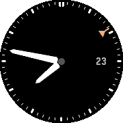

# Aeronaut

Aeronaut is a watch face inspired by pilot's watches. It's got a minimal bezel, large (yet precise) hands, and a 24-hour UTC (GMT) pointer.

It's in very early stages right now; basically none of the planned features are in yet.

# Tasks

- [x] GMT pointer
- [ ] Support platforms other than Chalk
- [ ] Settings via Clay
- [ ] Configurable colors
- [ ] Configurable complications
- [ ] Health complication
- [ ] Weather complication
- [ ] Aviation weather (METAR) complication - data from location or a locked station
- [x] `fctx` for better antialiasing
- [x] svg-derived assets

Aeronaut was originally derived from [SimpleAnalog](https://github.com/pebble-examples/simple-analog/blob/master/LICENSE), but only a few small chunks of that example remain.
